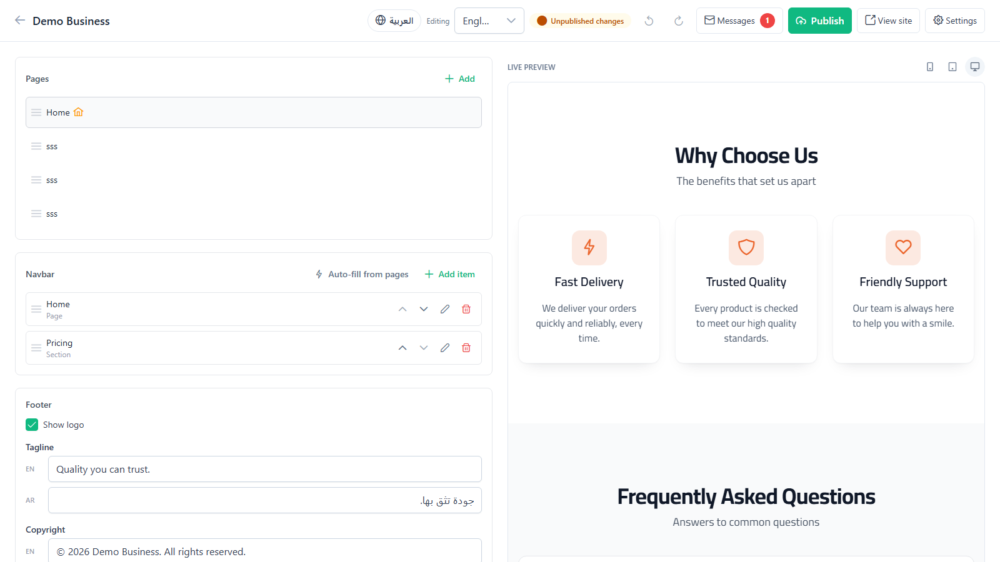
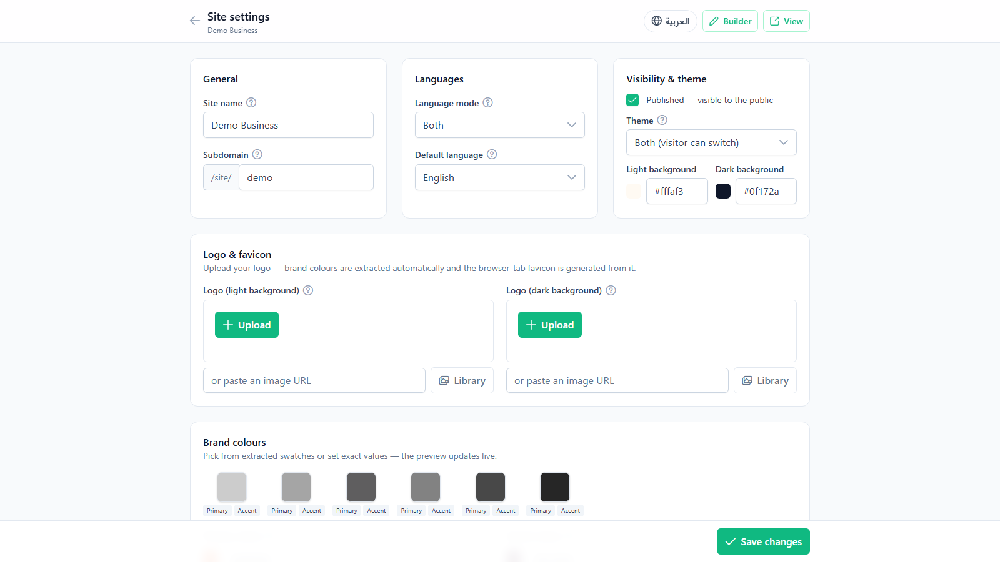
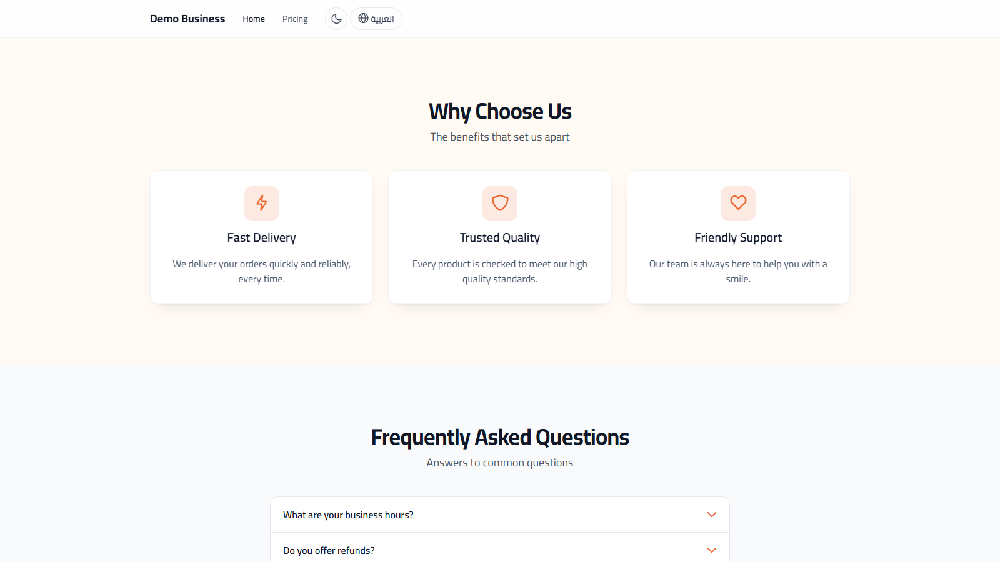

<div align="center">

# 🏗️ Website Builder

**A no-code, bilingual (Arabic / English) website builder for business landing pages.**

Non-technical owners assemble responsive marketing sites from ready-made sections, theme them
from their own logo, and publish under a subdomain at `/site/{subdomain}` — no code required.

[](https://angular.dev)
[](https://nestjs.com)
[](https://www.typescriptlang.org)
[](https://www.postgresql.org)
[](https://tailwindcss.com)
[](#-license)

</div>

---

## 📑 Table of contents

- [Overview](#-overview)
- [Screenshots](#-screenshots)
- [Features](#-features)
- [Tech stack](#-tech-stack)
- [Architecture](#-architecture)
- [Getting started](#-getting-started)
- [Configuration](#-configuration)
- [Usage](#-usage)
- [Available scripts](#-available-scripts)
- [Roadmap](#-roadmap)
- [Contributing](#-contributing)
- [License](#-license)
- [Acknowledgements](#-acknowledgements)

---

## 🔭 Overview

Website Builder lets a business owner create a polished, fully **bilingual (AR/EN, RTL/LTR)**
landing page by dragging ready-made sections onto a page, editing their content in a live
preview, and theming the whole site from a single panel. When they hit **Publish**, the site
is served read-only to visitors at `/site/{subdomain}`.

It is built as a **monorepo** with a NestJS (Fastify) API and an Angular 22 single-page app.
Authentication is intentionally out of scope — the data model and API are designed to be
embedded behind an existing application's auth layer.

> **Status:** Working end-to-end. All **20 section types** render and have editors, the
> drag-and-drop builder supports multi-page sites, draft/publish, undo/redo and a device
> preview, and every site is themeable (colours, Google font, corner radius, light/dark theme),
> bilingual and RTL-aware.

---

## 📸 Screenshots

### The drag-and-drop builder
Edit pages, the navbar and the footer on the left while a live preview updates on the right —
with language toggle, device preview, undo/redo and one-click publish.



### Site settings & theming
Set the name and subdomain, language mode, light/dark theme and per-theme backgrounds, upload a
logo (brand colours and the favicon are derived from it) and tune the brand palette.



### The published site
The finished, responsive site visitors see at `/site/{subdomain}` — themeable, bilingual and
RTL-aware, with a visitor language and light/dark switch in the navbar.



---

## ✨ Features

### Drag-and-drop builder
- Reorder sections by drag-and-drop (or keyboard), inline-edit, duplicate and delete.
- Multi-page sites — add, rename, reorder, delete pages and set the home page.
- **Draft / Publish** workflow with **undo/redo** and an unsaved-changes guard.
- **Device preview** (mobile / tablet / desktop) and a live per-section editor.

### 20 ready-made sections
`Hero` · `Cards` · `Features` · `Accordion / FAQ` · `Gallery` · `Carousel` ·
`Testimonials` · `Stats` · `Call-to-action` · `Rich text` (WYSIWYG) · `Contact form` ·
`Social links` · `WhatsApp chat` · `Email` · `Pricing` · `Team` · `Logos` · `Video` ·
`Map` · `Steps`.

### Theming & brand identity
- Brand colours auto-extracted from the uploaded **logo** (and a favicon generated from it).
- Site-wide **Google font** picker (curated families that support both Arabic and Latin).
- Global **corner-radius** control (sharp → fully rounded) shared by all buttons/cards/inputs.
- **Light / dark / both** theme modes with a visitor toggle and per-theme backgrounds.
- Configurable **navbar alignment** (start / center / end) and a designed **footer**.

### Bilingual & accessible
- Every text field is **Arabic + English**, with automatic **RTL/LTR** layout.
- Fully bilingual admin UI with a language switcher.

### Media, content & delivery
- **Image uploads** with a built-in **cropper** (forced aspect ratios) or paste-a-URL, plus a
  reusable **media library** of past uploads.
- **Contact form** submissions stored in an inbox and emailed (Nodemailer); WhatsApp
  click-to-chat; shared **social links** used by both the footer and the social section.
- Per-site **SEO**: meta title/description and an auto-generated favicon.
- Starter **templates** and one-click site duplication.

---

## 🧰 Tech stack

| Layer        | Technology |
| ------------ | ---------- |
| **Backend**  | [NestJS 11](https://nestjs.com) (Fastify adapter), [TypeORM](https://typeorm.io), [PostgreSQL 16](https://www.postgresql.org), [Nodemailer](https://nodemailer.com), `@nestjs/schedule`, [`sharp`](https://sharp.pixelplumbing.com) (logo colour extraction + image processing) |
| **Frontend** | [Angular 22](https://angular.dev) (standalone components, signals), [Tailwind CSS v4](https://tailwindcss.com), [PrimeNG 21](https://primeng.org), [`ngx-quill`](https://github.com/KillerCodeMonkey/ngx-quill) (rich text), [Angular CDK](https://material.angular.io/cdk) drag-drop, `intl-tel-input`, `ngx-smart-cropper` |
| **Tooling**  | TypeScript, ESLint + Prettier, Docker Compose (PostgreSQL + Adminer) |

---

## 🗂️ Architecture

```
Website-builder/
├── backend/                 NestJS API (Fastify)
│   └── src/
│       ├── common/          LocalizedText, enums, section-content shapes
│       ├── entities/        Site, Page, Section, ContactMessage, Asset
│       ├── sites/           Site CRUD + logo upload + brand-colour extraction
│       ├── pages/           Page CRUD + reorder
│       ├── sections/        Section CRUD + reorder
│       ├── public/          Read-only published-site tree + contact submission
│       ├── upload/          Image upload + on-the-fly file serving (/uploads)
│       ├── assets/          Media library
│       ├── messages/        Contact inbox
│       ├── mail/            Nodemailer service
│       ├── templates/       Starter-site catalogue
│       └── main.ts          Bootstrap (global /api prefix, CORS, validation)
├── frontend/                Angular 22 SPA
│   └── src/app/
│       ├── core/            Models, ApiService, SiteStore, i18n, theme tokens
│       ├── features/
│       │   ├── builder/     Drag-drop builder, section editors, footer/navbar managers
│       │   ├── settings/    Site settings (identity, theme, SEO, layout)
│       │   └── public-site/ Public renderer + 20 section renderers
│       └── shared/          Reusable inputs (image picker, social links, phone, theme service)
└── docker-compose.yml       PostgreSQL + Adminer
```

The browser talks to `/api` (proxied to the backend in dev). The published site reads a
frozen snapshot from `/api/public/sites/{subdomain}`; uploaded media is served from
`/uploads/{filename}`.

---

## 🚀 Getting started

### Prerequisites

- **Node.js** 20.19+ (or 22+) and **npm**
- **Docker** (recommended, for PostgreSQL) — or a local PostgreSQL 16 instance

### 1. Clone

```bash
git clone https://github.com/mhwazrah/Website-Builder.git
cd Website-Builder
```

### 2. Start the database

```bash
docker compose up -d        # PostgreSQL on :5432, Adminer UI on :8080
```

> Prefer your own PostgreSQL? Create a `website_builder` database and update the env vars below.

### 3. Run the backend (NestJS API → http://localhost:3000)

```bash
cd backend
cp .env.example .env        # adjust if needed
npm install
npm run start:dev
```

With `DB_SYNCHRONIZE=true` (the dev default) TypeORM creates the schema automatically and the
app seeds a demo site on first run.

### 4. Run the frontend (Angular → http://localhost:4200)

```bash
cd frontend
npm install
npm start
```

The dev server proxies `/api` and `/uploads` to the backend (`proxy.conf.json`), so no extra
configuration is needed.

### 5. Open the app

| What | URL |
| ---- | --- |
| Builder / dashboard | http://localhost:4200 |
| Published demo site | http://localhost:4200/site/demo |
| Adminer (DB UI)     | http://localhost:8080 |
| API docs (Swagger)  | http://localhost:3000/docs |

---

## ⚙️ Configuration

Backend configuration lives in `backend/.env` (copy from `backend/.env.example`):

| Variable | Default | Description |
| -------- | ------- | ----------- |
| `PORT` | `3000` | API port |
| `DB_HOST` | `localhost` | PostgreSQL host |
| `DB_PORT` | `5432` | PostgreSQL port |
| `DB_USERNAME` | `builder` | Database user |
| `DB_PASSWORD` | `builder_pass` | Database password |
| `DB_DATABASE` | `website_builder` | Database name |
| `DB_SYNCHRONIZE` | `true` | Auto-create schema from entities (**dev only** — use migrations in production) |
| `MAIL_HOST` | _(empty)_ | SMTP host. Leave empty to log emails to the console instead of sending |
| `MAIL_PORT` | `587` | SMTP port |
| `MAIL_SECURE` | `false` | Use TLS |
| `MAIL_USER` / `MAIL_PASSWORD` | _(empty)_ | SMTP credentials |
| `MAIL_FROM` | `Website Builder <no-reply@example.com>` | Default sender |
| `PUBLIC_WEB_URL` | `http://localhost:4200` | Frontend base URL used in emails/links |

---

## 📖 Usage

1. **Create a site** from the dashboard (pick a starter template or start blank).
2. **Settings** — set the name and subdomain, upload a logo (brand colours + favicon are
   derived automatically), choose the theme mode, font, corner radius and navbar alignment.
3. **Build** — add sections, drag to reorder, and edit each one in the live preview. Toggle
   the language (AR/EN) and the device size while editing.
4. **Publish** — promote the draft to the live snapshot. Visitors view it at
   `/site/{subdomain}`; contact submissions land in the inbox (and your email).

---

## 📜 Available scripts

**Backend** (`backend/`)

| Script | Description |
| ------ | ----------- |
| `npm run start:dev` | Run the API in watch mode |
| `npm run build` | Compile to `dist/` |
| `npm run start:prod` | Run the compiled build |
| `npm run lint` | ESLint (auto-fix) |
| `npm test` | Unit tests (Jest) |

**Frontend** (`frontend/`)

| Script | Description |
| ------ | ----------- |
| `npm start` | Dev server with HMR + API proxy |
| `npm run build` | Production build |
| `npm test` | Unit tests (Karma/Jasmine) |

---

## 🗺️ Roadmap

- [ ] Authentication & multi-tenant ownership (data model is auth-ready)
- [ ] Database migrations for production (replace `synchronize`)
- [ ] Custom domains for published sites
- [ ] More section types and starter templates
- [ ] Analytics for published sites

---

## 🤝 Contributing

Contributions are welcome! Please:

1. Fork the repo and create a feature branch (`git checkout -b feat/my-feature`).
2. Keep the existing style (ESLint + Prettier) — run `npm run lint` in the package you touch.
3. Make sure both `backend` and `frontend` build (`npm run build`).
4. Open a pull request describing the change.

---

## 📄 License

Released under the [Apache License 2.0](LICENSE).

---

## 🙏 Acknowledgements

Built with [NestJS](https://nestjs.com), [Angular](https://angular.dev),
[PrimeNG](https://primeng.org), [Tailwind CSS](https://tailwindcss.com) and
[TypeORM](https://typeorm.io).
